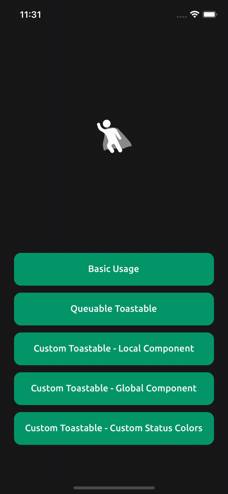

# react-native-toastable

🍞 Blazingly fast and fully customizable Toaster component for React Native

- Highly customizable, allowing you to tailor it to fit your specific needs
- Performant, using native animations and avoiding unnecessary re-renders
- Zero external dependencies (except for React Native itself)
- Supports queuinge, so you can display multiple toasts in succession without having to worry about them overlapping or interfering with each other




## Installation

```sh
yarn add react-native-toastable
```

or

```sh
npm install react-native-toastable
```

## Usage
Place Toastable component at the root of your app, and use `showToastable` function to show toast.
You can override default children component by passing `renderContent` function to `showToastable` function or directly to `Toastable` component. Please see examples below. 

All examples below assume that you have placed `Toastable` component at the root of your app and imported necessary components and functions.
### Basic Usage

```js
import * as React from 'react';

import { Button, StyleSheet, View } from 'react-native';
import Toastable, { showToastable } from 'react-native-toastable';

export default function Example() {
    return (
        <View style={{flex:1}}>
            <Button
                title="Show Toastable"
                onPress={() =>
                    showToastable({
                        title: 'React Native Heroes',
                        message: 'We are the heroes of React Native 🚀',
                        status: 'info',
                    })
                }
            />
            <Toastable />
        </View>
    );
}
```

### Qeuueing Toastables

```js
let number = 0

export default function Example() {
    return (
        <View style={{flex:1}}>
            <Button
                title="Show Toastable"
                onPress={() => {
                    const status = ['success', 'info', 'warning', 'danger'][Math.floor(Math.random() * 4)];
                    number++;
                    showToastable({
                        message: 'Message ' + number,
                        title: 'React Native Heroes ' + status,
                        status,
                        duration: 1500,
                    });
                }}
            />
            <Toastable />
        </View>
    );
}
```

### Custom Toastable - Local Component
You can pass your own `renderContent` function to `showToastable` function.

```js
export default function Example() {
    return (
        <View style={{flex:1}}>
            <Button
                title="Show Toastable"
                onPress={() =>
                    showToastable({
                        renderContent: ({ message, title, status = 'info' }) => (
                            <View
                                style={{
                                    flexDirection: 'row',
                                    backgroundColor: TOASTABLE_STATUS_MAP[status],
                                    paddingVertical: 12,
                                    paddingHorizontal: 16,
                                    borderRadius: 12,
                                }}>
                                <Icon size={20} name="cloud-upload" />
                                <View style={{ marginLeft: 12, flex: 1 }}>
                                    <Text style={{ marginTop: 2 }}>
                                        {title}
                                    </Text>
                                    <Text
                                        numberOfLines={1}
                                        adjustsFontSizeToFit
                                        style={{ marginTop: 8 }}>
                                        {message}
                                    </Text>
                                </View>
                                <Icon size={20} name="x" />
                            </View>
                        ),
                        message: 'filetitle.pdf was uploaded successfully',
                        title: 'Upload successful',
                        status: 'success',
                    })
                }
            />
        </View>
    );
}

```

### Custom Toastable - Global Component
You can pass your own `renderContent` function to `Toastable` component.

```js
export default function Example() {
    return (
        <View style={{flex:1}}>
            <Button
                title="Show Toastable"
                onPress={() =>
                    showToastable({
                        title: 'React Native Heroes',
                        message: 'We are the heroes of React Native 🚀',
                        status: 'success',
                    })
                }
            />
            <Toastable
                renderContent={(props) => {
                    return (
                        <View
                            style={{
                                flexDirection: 'row',
                                justifyContent: 'space-between',
                                alignItems: 'center',
                                paddingVertical: 16,
                                paddingHorizontal: 12,
                                backgroundColor: TOASTABLE_STATUS_MAP[props.status ?? 'info'],
                                borderRadius: 12,
                                borderBottomLeftRadius: 0,
                                borderBottomRightRadius: 0,
                            }}>
                            <View style={dw.rowHCenter}>
                                <ClearText color="gray-100">{props.title}</ClearText>
                                <ClearText
                                    color="gray-400"
                                    style={{ marginTop: 4 }}
                                    variant="small-none-regular">
                                    {props.message}
                                </ClearText>
                            </View>
                        </View>
                    );
                }}
            />
        </View>
    );
}

```
### Custom Toastable - Custom Status Colors

```js
export default function Example() {
    return (
        <View style={{flex:1}}>
            <Button
                title="Show Toastable"
                onPress={() => showToastable({ message: 'React Native Heroes is awesome! 🚀', status:'success' })}
            />
            <Toastable
                statusMap={{
                    success: '#00BFA6',
                    danger: '#FF5252',
                    warning: '#FFD600',
                    info: '#2962FF',
                }}
            />
        </View>
    );
}

```

## Advanced Usage

### Control toastable's content through `showToastable` function

```js
export default function Example() {
    return (
        <View style={{flex:1}}>
            <Button
                title="Show Toastable"
                onPress={() =>
                    showToastable({
                        message: 'React Native Heroes is awesome! 🚀',
                        alwaysVisible: true,
                        animationInTiming: 1000,
                        animationOutTiming: 1000,
                        backgroundColor: 'red',
                        duration: 2000,
                        contentStyle: {
                            marginHorizontal: 20,
                        },
                        onPress: () => {
                            console.log('onPress');
                        },
                        status: 'success',
                        swipeDirection: 'left',
                        messageColor: 'white',
                    })
                }
            />
            <Toastable />
        </View>
    );
}

```

## Control its content through `Toastable` component

```js
export default function Example() {
    return (
        <View style={{flex:1}}>
            <Button
                title="Show Toastable"
                onPress={() =>
                    showToastable({ message: 'React Native Heroes is awesome! 🚀', status: 'success'})
                }
            />
            <Toastable
                containerStyle={{ marginHorizontal: 20 }}
                alwaysVisible
                animationInTiming={2000}
                animationOutTiming={2000}
                duration={5000}
                onToastableHide={() => {
                    console.log('onToastableHide');
                }}
                statusMap={{
                    success: 'green',
                    danger: 'red',
                    info: 'blue',
                    warning: 'yellow',
                }}
                renderContent={(props) => <ToastableBody {...props} />}
                swipeDirection={['left', 'right']}
            />
        </View>
    );
}

```


## Props
Inherit all other props from `ToastableBodyParams` interface. Except `backgroundColor`, `status`, `message`, `onPress`, `contentStyle` props.

| Property            | Type                 | Description                                                                                             | Default                                                   |
|---------------------|----------------------|---------------------------------------------------------------------------------------------------------|-----------------------------------------------------------------|
| statusMap           | `StatusMap`            | Status map, used to determine background color based on status                                         | `success: '#00BFA6', danger: '#FF5252', warning: '#FFD600', info: '#2962FF'` |
| onToastableHide     | `Func`           | Callback when toast is dismissed                                                                        | `undefined`                                                       |
| containerStyle      | `ViewProps['style']`   | Container style for toast container                                                                     | `undefined`                                                       |

## ToastableBodyParams

| Params         | Type                                                      | Description                                                                                                                    | Default   |
| ---------------- | --------------------------------------------------------- | ------------------------------------------------------------------------------------------------------------------------------ | --------- |
| renderContent    | `(props: ToastableBodyParams) => React.ReactNode`         | Render custom content, if this is set, message will be ignored.                                                               | `undefined`         |
| contentStyle     | `ViewProps['style']`                                      | Custom content style.                                                                                                           | `undefined` |
| backgroundColor  | `ColorValue`                                              | Custom background color, if this is set, status will be ignored.                                                               | `undefined` |
| status           | `ToastableMessageStatus`                                  | Message status, this will be used to determine background color based on `statusMap` prop.                                     | `'info'`   |
| message          | `TextProps['children']`                                    | Message to be displayed.                                                                                                         | `undefined`      |
| onPress          | `Func`                                              | On press callback.                                                                                                              | `undefined` |
| duration         | `number`                                                  | Duration in milliseconds.                                                                                                       | `3000`    |
| alwaysVisible    | `boolean`                                                 | Make toast always visible, even when there is a new toast.                                                                       | `false`   |
| animationOutTiming | `number`                                                | Animation timing for toast out in milliseconds.                                                                                 | `300`     |
| animationInTiming  | `number`                                                | Animation timing for toast in in milliseconds.                                                                                  | `300`     |
| swipeDirection   | `'up' \| 'left' \| 'right' \| Array<'up' \| 'left' \| 'right'>` | Swipe direction to dismiss toast.                                                                                               | `'up'`    |
titleColor | `ColorValue` | Custom title color, if this is set. | `'#FFFFFF'` | 
| messageColor | `ColorValue` | Custom message color, if this is set. | `'#FFFFFF'` |
titleStyle | `TextStyle` | Custom title style. | `undefined` |
messageStyle | `TextStyle` | Custom message style. | `undefined` |


## Roadmap

- Add more examples
- Support animationIn and animationOut props
- Support stackable toasts
- Support custom animations
- Support snackbars
- Add custom status support

## Contributing

See the [contributing guide](CONTRIBUTING.md) to learn how to contribute to the repository and the development workflow.

## License

MIT

---

Made with [create-react-native-library](https://github.com/callstack/react-native-builder-bob)
